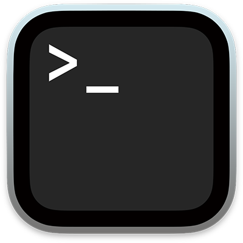
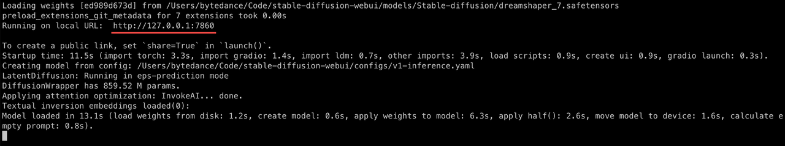

<p align="left">
    <a href="README_CN.md">中文</a> &nbsp ｜ &nbsp English
</p>

# Stable Diffusion Installer For Mac

[](https://conventionalcommits.org)  

Assist you in **quickly and effortlessly** installing the Stable Diffusion web UI on your Mac.

## Usage

1. In the **Applications** folder, locate **Terminal**  and open it.

2. Copy the following command to the **terminal**, press the **Enter key** to execute the command, and the installation will start automatically. Just wait for the installation to complete.

   ```bash
   /bin/bash -c "$(curl -fsSL https://raw.githubusercontent.com/wy-luke/StableDiffusion-Installer-For-Mac/main/sd-installer.sh)"
   ```

3. At the beginning, you will be prompted to enter password, just type your login password.

   > Note: Your password will be invisible when you type, just type it, and press Enter after completion.

4. If you see similar content below, it indicates a successful installation.

   

5. Open your web browser and enter `http://127.0.0.1:7860` (the underlined part in the image above) to access the Stable Diffusion web UI.

6. If the installation fails, you will be prompted whether to retry. Type `y` or just simply **press the Enter key** to try again. Type `n` to exit.

## Features

1. Use [Homebrew](https://brew.sh/) to install required dependencies. If you already have it installed, it will be used automatically. If not, it will be installed for you, but without modifying your system environment – your system will remain unchanged.

   If you wish to activate it by default, you can add `eval $(/opt/homebrew/bin/brew shellenv)` to your `.zprofile` (zsh) or `.bash_profile` (bash) file.

   You could also:

   ```bash
   # zsh
   echo 'eval $(/opt/homebrew/bin/brew shellenv)' >> /Users/$USER/.zprofile
   eval $(/opt/homebrew/bin/brew shellenv)

   # bash
   echo 'eval $(/opt/homebrew/bin/brew shellenv)' >> /Users/$USER/.bash_profile
   eval $(/opt/homebrew/bin/brew shellenv)
   ```

2. Use [micromamba](https://mamba.readthedocs.io/en/latest/user_guide/micromamba.html), which is a tiny version of the [mamba](https://mamba.readthedocs.io/en/latest/index.html#), as python related package and environment manager instead of Conda.

   Compared to Conda, it has no base environment (empty) nor default version of Python, meaning that it won't interfere or contaminate your system's Python environment at all. Additionally, it's significantly faster.

   Similarly, it isn't added to the system environment either, and won't be activated automatically by default.

   But if you want, you could:

   ```bash
   # zsh
   /opt/homebrew/bin/micromamba shell init -s zsh -p ~/micromamba
   source ~/.zshrc

   # bash
   /opt/homebrew/bin/micromamba shell init -s bash -p ~/micromamba
   source ~/.bashrc
   ```
