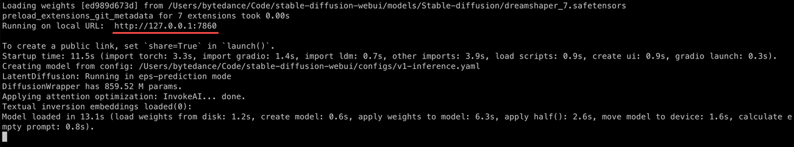

<p align="left">
    <a href="README.md">English</a> &nbsp ｜ &nbsp 中文
</p>

# Stable Diffusion Installer For Mac

[](https://conventionalcommits.org)   [](https://github.com/wy-luke/StableDiffusion-Installer-For-Mac/actions/workflows/test.yml)

一条命令为你的 Mac 装上 Stable Diffusion web UI:

```bash
/bin/bash -c "$(curl -fsSL https://raw.githubusercontent.com/wy-luke/StableDiffusion-Installer-For-Mac/main/sd-installer.sh)"
```

国内用户存在网络问题时，可以尝试使用以下命令（可能会存在缓存，更新不及时）：

```bash
curl -fsSL https://ghproxy.com/https://raw.githubusercontent.com/wy-luke/StableDiffusion-Installer-For-Mac/main/sd-installer.sh | /bin/bash -s -- -c
```

使用 mamba 创建虚拟环境，所以不会和你系统的 Python 环境冲突，并且不会造成任何污染，保持你的系统环境干净如初。同时，一键卸载脚本也在开发中，敬请期待。

理论上讲，适用于所有的 Mac。

如果你遇到任何问题，或者需要新的功能，欢迎通过[这里](https://github.com/wy-luke/StableDiffusion-Installer-For-Mac/issues/new)与我联系。

## 详细步骤

1. 在**应用程序**中，找到**终端**  并打开

   > 注意：在 `/应用程序/实用工具` 文件夹中，如果还是找不到，那就使用名字搜索吧。

2. 复制下面的命令到**终端**中，按**回车键**执行命令，然后就会自动开始安装，只需静静等待完成

   ```bash
   /bin/bash -c "$(curl -fsSL https://raw.githubusercontent.com/wy-luke/StableDiffusion-Installer-For-Mac/main/sd-installer.sh)"
   ```

   国内用户存在网络问题时，可以尝试使用以下命令（可能会存在缓存，更新不及时）：

   ```bash
   curl -fsSL https://ghproxy.com/https://raw.githubusercontent.com/wy-luke/StableDiffusion-Installer-For-Mac/main/sd-installer.sh | /bin/bash -s -- -c
   ```

   该命令会在安装时使用国内源，进行网络加速，包括 Homebrew、Conda-forge、Pip、Github 等, 但可能会不稳定或失效, 若安装失败可以尝试重试，还是不行的话，可以通过[这里](https://github.com/wy-luke/StableDiffusion-Installer-For-Mac/issues/new)与我联系。

3. 在安装开始时，会提示输入密码，这里是你的 **Mac 登录密码**。

   > 注意：密码在输入时是不可见的，只需正常输入，完成后按 Enter 键。

4. 如果出现类似下面的内容，即为安装成功

   

5. 打开浏览器，输入 `http://127.0.0.1:7860`(即上图划线部分)，即可打开 Stable Diffusion web UI

   > 提示 1：通常来讲，浏览器会自动打开，并进入该页面，无需手动进行第 5 步

   > **提示 2：在使用过程中，一定不要关闭 终端 程序，否则 SD 会无法使用。如果你不小心关闭了终端，可以参考下面的 再次启动 部分**

6. 如果安装失败，会提示您是否重试。输入 `y` 或**按 Enter 键**重试，输入 `n` 退出安装。

## 再次启动

在使用 SD 时，需要**保持终端的运行**，使用完成后，关闭浏览器页面和终端即可。

如果想要在第一次使用完成后，再次启动 SD，可以使用下面的命令：

```bash
/bin/bash $HOME/stable-diffusion-webui/webui.sh
```

如果你移动了 `stable-diffusion-webui` 文件夹的位置，需要把 `$HOME` 更换为你的路径，同时注意 `/webui.sh` 始终要在命令结尾：

```bash
/bin/bash /your/path/of/stable-diffusion-webui/webui.sh
```

## 常见问题

### \*\*\*\* not implemented for 'Half' 未针对 "half" 实现

大概率是因为 AMD 显卡的兼容性差导致

解决方法也比较简单，运行下面的命令，然后**[再次启动](#再次启动)** SD 即可

```bash
echo 'export COMMANDLINE_ARGS="--upcast-sampling --no-half-vae --use-cpu interrogate --precision full --no-half --skip-torch-cuda-test"' > $HOME/stable-diffusion-webui/webui-user.sh
```

### MPS backend out of memory MPS 后端内存不足

内存/显存不足导致。可以在运行命令前加上 `PYTORCH_MPS_HIGH_WATERMARK_RATIO=0.7` 来降低 SD 的内存需求。

> 注意：这会让出图的时间变得更长，可以根据机器性能自行调节 `PYTORCH_MPS_HIGH_WATERMARK_RATIO` 的值。

**再次启动**的命令更换为：

```bash
PYTORCH_MPS_HIGH_WATERMARK_RATIO=0.7 /bin/bash $HOME/stable-diffusion-webui/webui.sh
```

如果还是内存不足，可以尝试继续降低数值，如 `PYTORCH_MPS_HIGH_WATERMARK_RATIO=0.5`

```bash
PYTORCH_MPS_HIGH_WATERMARK_RATIO=0.5 /bin/bash $HOME/stable-diffusion-webui/webui.sh
```

## 下载模型

将下载的模型放置到 `stable-diffusion-webui/models/Stable-diffusion` 文件夹中。然后在浏览器中刷新 Stable Diffusion web UI 页面，就可以在模型列表中看到它。

1. 一些流行的官方 Stable Diffusion 1.x 模型：

   - [Stable Diffusion 1.4](https://huggingface.co/CompVis/stable-diffusion-v-1-4-original) ([sd-v1-4.ckpt](https://huggingface.co/CompVis/stable-diffusion-v-1-4-original/resolve/main/sd-v1-4.ckpt))
   - [Stable Diffusion 1.5](https://huggingface.co/runwayml/stable-diffusion-v1-5) ([v1-5-pruned-emaonly.ckpt](https://huggingface.co/runwayml/stable-diffusion-v1-5/resolve/main/v1-5-pruned-emaonly.ckpt))
   - [Stable Diffusion 1.5 Inpainting](https://huggingface.co/runwayml/stable-diffusion-inpainting) ([sd-v1-5-inpainting.ckpt](https://huggingface.co/runwayml/stable-diffusion-inpainting/resolve/main/sd-v1-5-inpainting.ckpt))

2. Stable Diffusion 2.0 和 2.1 模型：

   - [Stable Diffusion 2.0](https://huggingface.co/stabilityai/stable-diffusion-2) ([768-v-ema.ckpt](https://huggingface.co/stabilityai/stable-diffusion-2/resolve/main/768-v-ema.ckpt))
   - [Stable Diffusion 2.1](https://huggingface.co/stabilityai/stable-diffusion-2-1) ([v2-1_768-ema-pruned.ckpt](https://huggingface.co/stabilityai/stable-diffusion-2-1/resolve/main/v2-1_768-ema-pruned.ckpt))

   这些模型需要同时使用模型和配置文件，并且在生成图像时需要将图像的宽度和高度设置为 768 或更高。

   对于配置文件，可以按住键盘上的 Option 键，然后点击[这里](https://github.com/Stability-AI/stablediffusion/raw/main/configs/stable-diffusion/v2-inference-v.yaml)下载 `v2-inference-v.yaml`（文件名也可能为 `v2-inference-v.yaml.yml`）。在 Finder 中将该文件重命名为模型的文件名，并保持文件扩展名不变，应该为 `.yaml` 而不是 `.ckpt`（如果有提示，请**确认更改文件扩展名**），并将其与模型放在同一个文件夹中。

   例如，如果你下载了 `768-v-ema.ckpt` 模型，将配置文件重命名为 `768-v-ema.yaml` 并将其与模型一起放在 `stable-diffusion-webui/models/Stable-diffusion` 中。

   - [Stable Diffusion 2.0 depth model](https://huggingface.co/stabilityai/stable-diffusion-2-depth) ([512-depth-ema.ckpt](https://huggingface.co/stabilityai/stable-diffusion-2-depth/resolve/main/512-depth-ema.ckpt))。

   通过按住键盘上的 Option 键并单击[这里](https://github.com/Stability-AI/stablediffusion/raw/main/configs/stable-diffusion/v2-midas-inference.yaml)下载 `v2-midas-inference.yaml` 配置文件，然后按照上述方式以 `.yaml` 结尾的方式重命名它，并与模型放在 `stable-diffusion-webui/models/Stable-diffusion` 文件夹中。请注意，此模型适用于图像尺寸的宽度/高度为 512 或更高，而不是 768。

3. 你还可以在 [civitai](https://civitai.com/) 下载各种类型的模型，这是一个很棒的网站！

## 脚本优势

1. 使用 [Homebrew](https://brew.sh/) 来安装所需的依赖。如果已经安装，将会自动使用；如果没有，将会自动安装，但不会修改你的系统环境，你的系统将保持不变。

   如果你希望默认激活使用它，可以将 `eval $(/opt/homebrew/bin/brew shellenv)` 添加到 `.zprofile`（zsh）或 `.bash_profile`（bash）文件中。

   你也可以使用一下命令：

   ```bash
   # zsh
   echo 'eval $(/opt/homebrew/bin/brew shellenv)' >> /Users/$USER/.zprofile
   eval $(/opt/homebrew/bin/brew shellenv)

   # bash
   echo 'eval $(/opt/homebrew/bin/brew shellenv)' >> /Users/$USER/.bash_profile
   eval $(/opt/homebrew/bin/brew shellenv)
   ```

2. 使用 [micromamba](https://mamba.readthedocs.io/en/latest/user_guide/micromamba.html)（[mamba](https://mamba.readthedocs.io/en/latest/index.html#) 的精简版本）作为 Python 的包和环境管理工具，而不是 Conda。

   与 Conda 相比，它没有 `base` 环境（为空），也没有默认的 Python 版本，这意味着它不会干扰或污染你的系统 Python 环境。此外，它的速度更快。

   同样地，它也不会被添加到你的系统环境中，不会被自动激活。但如果你想要的话，可以使用以下命令：

   ```bash
   # zsh
   /opt/homebrew/bin/micromamba shell init -s zsh -p ~/micromamba
   source ~/.zshrc

   # bash
   /opt/homebrew/bin/micromamba shell init -s bash -p ~/micromamba
   source ~/.bashrc
   ```

## 致谢

[AUTOMATIC1111](https://github.com/AUTOMATIC1111) 和 [stable-diffusion-webui](https://github.com/AUTOMATIC1111/stable-diffusion-webui)

[Homebrew](https://github.com/Homebrew/brew)

[Mamba](https://github.com/mamba-org/mamba)
